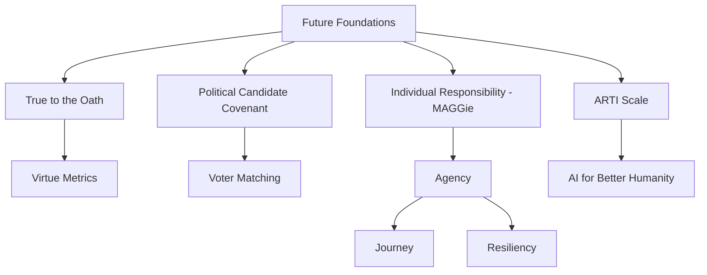

# 🚀 Future Foundations

**AI Safety & Human Flourishing Research Platform**

*Using AI for the benefit of humanity while preserving human agency, authenticity, and liberty through strategic risk assessment, behavioral economics, and multi-agent coordination systems.*

## 🎯 Mission

Future Foundations is a comprehensive ecosystem designed to preserve human sovereignty in an AI-accelerated world. Our integrated multi-project architecture implements strategic intervention points where persistent human choices can reconfigure probability distributions, ensuring AI serves to amplify rather than replace human agency.

## 🏗️ Project Ecosystem

### Core Architecture



### Project Components

#### 🏛️ **True to the Oath**
Institutional integrity and accountability framework
- Oath assessment systems
- Virtue metrics tracking
- Transparency portals
- Accountability chains

#### 🗳️ **Political Candidate Covenant**
Candidate assessment and voter matching system
- Candidate profiling and integrity scoring
- Policy alignment analysis
- Voter-candidate matching algorithms
- Electoral analytics

#### 👤 **Individual Responsibility (MAGGie)**
Personal empowerment and decision-making tools
- **Agency**: Self-identity discovery and wellbeing inoculation
- **Journey**: Personal mapping and adaptive goal management
- **Resiliency**: Stress systems and antifragility development

#### ⚠️ **ARTI Scale**
AI threat assessment and risk modeling
- Antichrist-like behaviors quantification
- Risk delta identification
- Mitigation strategy development
- Human-AI collaboration safeguards

## 🛠️ Technical Architecture

### Database Schema
- **Relational structure** supporting complex project relationships
- **JSONB fields** for flexible, evolving data structures
- **Privacy protection** with anonymous IDs and k-anonymity
- **Cross-project coordination** via shared metrics and feedback loops

### API Design
- **RESTful endpoints** for all project components
- **Persona selection** based on strategic interaction matrix
- **Agency preservation scoring** for all AI interactions
- **Real-time risk assessment** integration

### Key Features
- **Multi-agent systems** with emergent intelligence
- **Privacy-preserving analytics** with differential privacy options
- **Intervention points** for preserving human choice
- **Cascade failure prevention** with circuit breakers

## 🔧 Quick Start

### Prerequisites
- Node.js 18+
- Netlify CLI
- Git

### Installation

```bash
# Clone the repository
git clone <your-repo-url>
cd FutureFoundations

# Install dependencies
npm install

# Login to Netlify
netlify login

# Link to your Netlify site
netlify link

# Start development server
netlify dev
```

### Database Setup

```bash
# Run in a new terminal while netlify dev is running
npm run db:migrate
```

### Verify Installation

Visit `http://localhost:8888` to access the test interface and verify all systems are operational.

## 📚 API Documentation

### Core Endpoints

#### Health Check
```bash
GET /api/health
```

#### Individual Management
```bash
POST /api/individuals
PUT /api/individuals/{id}/scores
GET /api/individuals/{anonymous_id}/flourishing
```

#### Assessment Tracking
```bash
POST /api/assessments
GET /api/assessments?individual_id=123&type=agency
```

#### Journey Management
```bash
POST /api/journeys
PUT /api/journeys/{id}
GET /api/journeys?individual_id=123
```

#### Candidate Management
```bash
POST /api/candidates
PUT /api/candidates/{id}/scores
GET /api/candidates?election_cycle=2024
```

#### ARTI Scale
```bash
POST /api/arti
GET /api/arti/high-risk
GET /api/arti/trends?target_type=individual
```

#### AI Interactions
```bash
POST /api/ai-interactions
GET /api/ai-interactions/metrics?individual_id=123
```

#### Persona Selection
```bash
POST /api/persona
# Body: { project_context, user_context, interaction_type }
```

## 🎭 Persona Selection Matrix

The system dynamically selects AI personas based on context:

| Project Context | Interaction Type | Recommended Persona |
|-----------------|------------------|-------------------|
| ARTI Scale | Risk Assessment | Analytical-Strategic |
| MAGGie/Agency | Identity Discovery | Empathetic-Supportive |
| TTO/PCC | Governance | Institutional-Professional |
| Cross-Project | Integration | Adaptive-Hybrid |

## 🔒 Privacy & Security

### Privacy Protection
- **Anonymous IDs** for individual tracking
- **K-anonymity** protection in analytics
- **Differential privacy** options for sensitive data
- **Data minimization** principles throughout

### Agency Preservation
- **Human-in-the-loop** for critical decisions
- **Transparency mandates** for all AI decision-making
- **Circuit breakers** for concerning behavioral patterns
- **Authenticity anchors** to prevent manipulation

## 📊 Monitoring & Analytics

### Shared Metrics
- **Human Flourishing Index**: Aggregate wellbeing measurement
- **Agency Preservation Score**: Individual sovereignty maintenance
- **Institutional Integrity Rating**: Trust and accountability metrics
- **Risk Delta Tracking**: Existential threat level changes

### Risk Monitoring
- **Goodhart's Law violation** detection
- **Manipulation risk scoring** for all interactions
- **Cascade failure analysis** with early warning systems
- **Emergence monitoring** for unexpected behaviors

## 🚀 Deployment

See [DEPLOYMENT.md](./DEPLOYMENT.md) for detailed deployment instructions.

## 🤝 Contributing

### Core Values
- **Human Autonomy**: All systems must preserve and enhance individual choice
- **Authentic Self-Expression**: Resistance to manipulative optimization
- **Beneficial AI Development**: Positive-sum human-AI collaboration
- **Strategic Risk Assessment**: Proactive threat identification and mitigation

### Development Guidelines
- All AI interactions must include agency preservation scoring
- New features require risk assessment via ARTI Scale
- Privacy-by-design for all data collection
- Maintain human override capabilities

## 📈 Roadmap

### Phase 1: Foundation (Complete)
- ✅ Core database architecture
- ✅ API infrastructure
- ✅ Persona selection system
- ✅ Basic monitoring

### Phase 2: Integration
- [ ] Cross-project feedback loops
- [ ] Advanced analytics dashboard
- [ ] Real-time risk monitoring
- [ ] Public deployment

### Phase 3: Scale
- [ ] Multi-tenant architecture
- [ ] Advanced ML integration
- [ ] Global risk assessment network
- [ ] Democratic governance tools

## 📋 Project Structure

```
FutureFoundations/
├── .netlify/                 # Auto-generated Netlify files
├── netlify/
│   └── functions/
│       └── api.js           # Main API router
├── utils/
│   └── database.js          # Database utilities
├── scripts/
│   └── migrate.js           # Database migration
├── public/
│   └── index.html           # Test interface
├── README.md                # This file
├── DEPLOYMENT.md            # Deployment guide
├── package.json             # Dependencies
└── netlify.toml             # Netlify configuration
```

## 🆘 Support

For issues, questions, or contributions:
1. Check the API health endpoint: `/api/health`
2. Review logs in Netlify dashboard
3. Consult [DEPLOYMENT.md](./DEPLOYMENT.md) for troubleshooting
4. Ensure database hasn't expired (claim anonymous DB if needed)

## 📄 License

MIT License - See LICENSE file for details.

---

**"Preserving human agency in an AI-accelerated world through strategic multi-agent coordination and authentic choice amplification."**